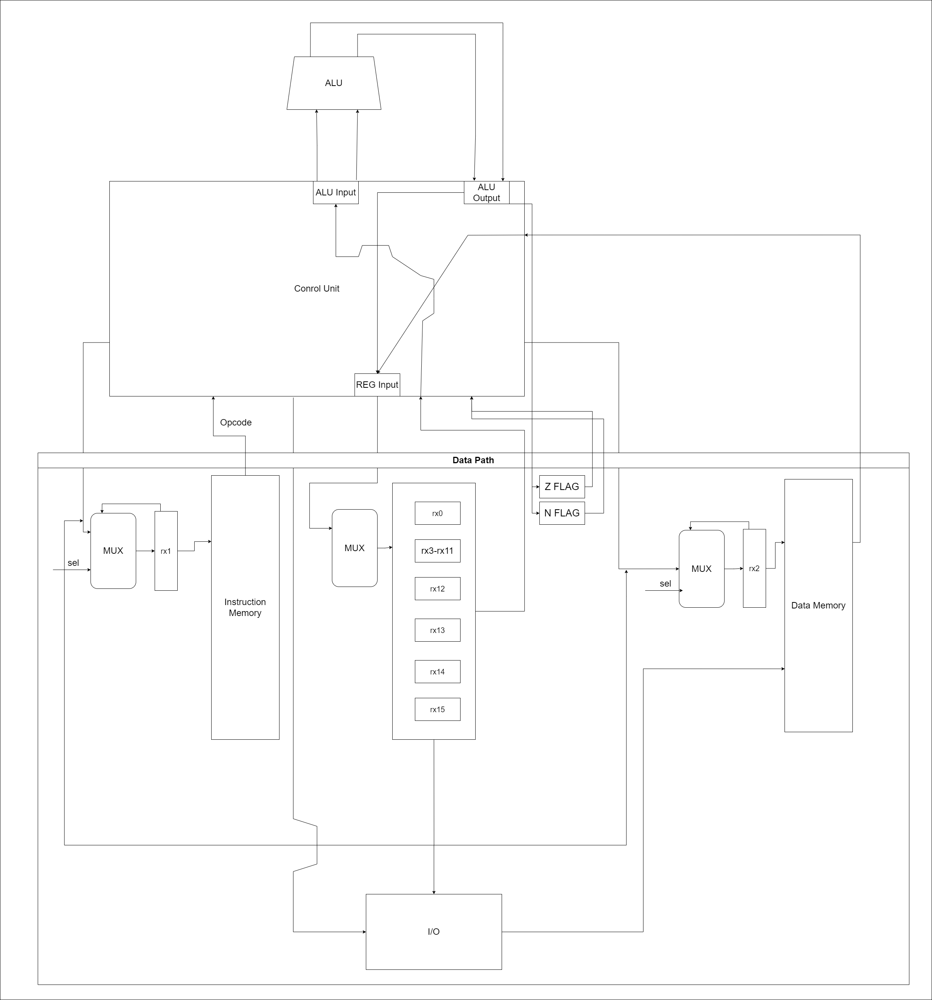

# Computer Science Architecture Lab 3

Степанов Михаил Андреевич P33312

## Вариант

'alg | risc | harv | hw | instr | struct | stream | port | prob5'

* 'alg' - java/javascript подобный язык
* 'risc' - система команд должна быть упрощенной, в духе RISC архитектур
* 'harv' - Гарвардская архитектура
* 'hw' - Control Unit реализован как часть модели, микрокода нет
* 'instr' - каждая инструкиция расписана по-тактово, но в журнале фиксируется только результат выполнения
* 'struct' - в виде высокоуровневой структуры данных. Одна инструкция укладывается в одно машинное слово
* 'stream' - ввод-вывод осуществляется как поток токенов
* 'port' - port-mapped
* 'prob5' - Project Euler. Problem 5

## Язык программирования

Использована упрощенная версия языка JavaScript
Типизация: статическая сильная неявная

* Объявление переменных через ключевое слово `let`
* Доступен цикл `while`
* Доступна функция ввода `input()` и функция вывода `print()`
* Доступна инструкция ветвления `if`
* Разрешенные математические операции:
  * `+` - бинарный плюс
  * `-` -  бинарный минус
  * `=` - присваивание
  * `*` - умножение
  * `%` - остаток от деления

### BNF

#### `<program> ::= (<source element>)+`
#### `<source element> ::= <statement>`
#### `<statement> ::= <allocation statement> | <assignment statement> | <if statement> | <iteration statement> | <read statement> | <print statement>`
#### `<allocation statement> ::= "let" <name> "=" <number> | <row> ";"`
#### `<assignment statement> ::= <name> "=" <number> | <name> | <expression> ";"`
#### `<if statement> ::= "if" (<name> | <expression> | <number>) <comparison sign> (<name> | <expression> | <number>) "\n{" (<statement>)+ "}"`
#### `<iteration statement> ::= "while" (<name> | <expression> | <number>) <comparison sign> (<name> | <expression> | <number>) "\n{" (<statement>)+ "}"`
#### `<read statement> ::= "input(" <name> ");"`
#### `<print statement> ::= "print( <name> ");"`
#### `<expression> ::= (<name> | <number>) <operation sign> (<name> | <number>)`
#### `<comparison sign> ::= "!=" | "==" | ">" | "<" | "<=" | ">="`
#### `<name> ::= [a-zA-Z]+`
#### `<number> ::= [0-9]+`
#### `<row> ::= "[a-zA-Z]*"`
#### `<operation sign> ::= "+" | "-" | "/" | "%" | "*"`

### Пример
```javascript
let n = 2520;
let i = 20;
while (i > 0)
{
if (n % i == 0)
{
i = i - 1;
}
else
{
n = n + 2520;
i = 20;
}
if (i == 1)
{
print(n);
}
}
```

```javascript
let temp = "hello, world";
print(temp);
```

## Процессор

Реализован в модуле [machine.py](./machine.py)

Интерфейс командной строки с запуском модуля: `python machine.py <target_file> <input_file>`

### Модель процессора


Управляющие сигналы:
* Sel(rx1)  - выставить значение регистра rx1
  * 1 - увеличить на 1
  * 0 - загрузить значение из вне
* Sel(rx2) - выставить значение регистра rx2
  * 1 - увеличить на 1
  * 0 - загрузить значние из вне
* Sel(reg) - загрузить значение в указанный регистр

### Организация памяти

Память инструкций и данных раделены на два модуля.

Модель памяти процессора:
* Память команд - Машинное слово не определено, реализация при помощи массива словарей
* Память данных - 32 байта, знаковое

Размер памяти данных - 2048
Размер памяти инструкций - 2048

В процессоре всего расположено 16 регистров.
* `rx0` - регистр, постоянно хранящий 0
* `rx1` - регистр текущей инструкции
* `rx2` - регистр текущей адресации в модуле памяти данных
* `rx3 - rx11` - регистры общего назначения
* `rx12` - указатель стека
* `rx13` - регистр, хранящий результат операции '/'
* `rx14` - регистр, хранящий результат операции '%'
* `rx15` - регистр для загрузки аргумента для прыжка

Присутствует два флага состояния на выходах АЛУ - Zero Flag и Negative Flag 

Адреса расположения данных в памяти определяются во время трансляции линейно от начала адресного пространства.

### Набор инструкций
| Синтаксис           | Кол-во тактов | Комментарий                                   |
|:--------------------|:--------------|:----------------------------------------------|
| `ld` (reg) (int)    | 2             | int -> reg                                    |
| `ld` (reg) rx2      | 3             | data_mem[rx2] -> reg                          |
| `wr` (reg)          | 3             | reg -> data_mem[rx2]                          |
| `add` (reg1) (reg2) | 3             | reg1 + reg2 -> reg1                           |
| `sub` (reg1) (reg2) | 3             | reg1 - reg2 -> reg1                           |
| `mul` (reg1) (reg2) | 3             | reg1 * reg2 -> reg1                           |
| `div` (reg1) (reg2) | 3             | reg1 / reg2 -> rx13<br/>reg1 % reg2 -> rx14   |
| `input`             | 3             | i_buf -> data_mem[rx2]                        |
| `print` (reg) (1/0) | 3             | reg -> o_buf<br/>ch(reg) -> o_buf             |
| `jmp`               | 3             | rx15 -> rx1                                   |
| `inc` (reg)         | 3             | reg + 1 -> reg                                |
| `dec` (reg)         | 3             | reg - 1 -> reg                                |
| `jle` (reg1) (reg2) | 3             | zero_flag OR neg_flag => rx15 -> rx1          |
| `jl` (reg1) (reg2)  | 3             | NOT zero_flag AND neg_flag => rx15 -> rx1     |
| `jne` (reg1) (reg2) | 3             | NOT zero_flag  => rx15 -> rx1                 |
| `je` (reg1) (reg2)  | 3             | zero_flag  => rx15 -> rx1                     |
| `jge` (reg1) (reg2) | 3             | zero_flag OR NOT neg_flag => rx15 -> rx1      |
| `jg` (reg1) (reg2)  | 3             | NOT zero_flag AND NOT neg_flag => rx15 -> rx1 |

Устройства ввода/вывода определены как два буфера данных, условно относящиеся к определенному порту

## Кодирование 

### Структура команды

* Машинный код представлен в формате JSON списка операционных команд
* Одна инструкция - словарь, содаержащий операционный код и аргументы

```json
{
    "opcode": "ld",
    "arg1": "rx15",
    "arg2": 22
}
```

* `opcode` - код операции
* `arg1` - первый аргумент (может отсутствовать) 
* `arg2` - второй аргумент аргумент (может отсутствовать)

### Транслятор

Реализован в модуле [translator.py](./translator.py)

Интерфейс командной строки с запуском модуля: `python translator.py <source_file> <target_file>`

Этапы трансляции:
* Загрузка исходного кода
* Рекурсивный проход по строкам в файле и обработка их в соответствии с регулярными выражениями
* Построение алгоритма работы программы
* Выгрузка алгоритма в конечный файл

Пример:

```javascript
let temp = "";
input(temp);
while (temp != EOF)
{
print(temp);
input(temp);
}
```

```json
[
    {
        "opcode": "ld",
        "arg1": "rx3",
        "arg2": 0
    },
    {
        "opcode": "wr",
        "arg1": "rx3"
    },
    {
        "opcode": "ld",
        "arg1": "rx2",
        "arg2": 0
    },
    {
        "opcode": "input"
    },
    {
        "opcode": "ld",
        "arg1": "rx15",
        "arg2": 15
    },
    {
        "opcode": "ld",
        "arg1": "rx2",
        "arg2": 0
    },
    {
        "opcode": "ld",
        "arg1": "rx4",
        "arg2": "rx2"
    },
    {
        "opcode": "je",
        "arg1": "rx4",
        "arg2": "rx0"
    },
    {
        "opcode": "ld",
        "arg1": "rx2",
        "arg2": 0
    },
    {
        "opcode": "ld",
        "arg1": "rx5",
        "arg2": "rx2"
    },
    {
        "opcode": "print",
        "arg1": "rx5",
        "arg2": 1
    },
    {
        "opcode": "ld",
        "arg1": "rx2",
        "arg2": 0
    },
    {
        "opcode": "input"
    },
    {
        "opcode": "ld",
        "arg1": "rx15",
        "arg2": 4
    },
    {
        "opcode": "jmp"
    },
    {
        "opcode": "halt"
    }
]
```

## Аппробация

* Исходные коды готовых программ
  * [hello_test.js](./tests/hello_test.js)
  * [cat_test.js](./tests/cat_test.js)
  * [prob5_test.js](./tests/prob5_test.js)
* Результаты работы транслятора
  * [hello.out](./tests/hello.out) 
  * [cat.out](./tests/cat.out) 
  * [prob5.out](./tests/prob5.out) 
* Входные данные для программ
  * [privet_input.txt](./tests/privet_input.txt)

Описание тестов - [integration_tests.py](./integration_tests.py)

Пример запуска теста:
```shell
> ./translator.py ./tests/hello_test.js ./tests/hello.out
> ./machine.py ./tests/hello.out ./privet_input.txt

DEBUG:root:{TICK: 4, RX1: 1, RX2: 0, RX3: 104, RX4: 0, RX5: 0, RX6: 0, RX7: 0, RX8: 0, RX9: 0, RX10: 0, RX11: 0, RX12: 2047, RX13: 0, RX14: 0, RX15: 0}
DEBUG:root:{TICK: 8, RX1: 2, RX2: 1, RX3: 104, RX4: 0, RX5: 0, RX6: 0, RX7: 0, RX8: 0, RX9: 0, RX10: 0, RX11: 0, RX12: 2047, RX13: 0, RX14: 0, RX15: 0}
DEBUG:root:{TICK: 12, RX1: 3, RX2: 1, RX3: 104, RX4: 101, RX5: 0, RX6: 0, RX7: 0, RX8: 0, RX9: 0, RX10: 0, RX11: 0, RX12: 2047, RX13: 0, RX14: 0, RX15: 0}
DEBUG:root:{TICK: 16, RX1: 4, RX2: 2, RX3: 104, RX4: 101, RX5: 0, RX6: 0, RX7: 0, RX8: 0, RX9: 0, RX10: 0, RX11: 0, RX12: 2047, RX13: 0, RX14: 0, RX15: 0}
DEBUG:root:{TICK: 20, RX1: 5, RX2: 2, RX3: 104, RX4: 101, RX5: 108, RX6: 0, RX7: 0, RX8: 0, RX9: 0, RX10: 0, RX11: 0, RX12: 2047, RX13: 0, RX14: 0, RX15: 0}
DEBUG:root:{TICK: 24, RX1: 6, RX2: 3, RX3: 104, RX4: 101, RX5: 108, RX6: 0, RX7: 0, RX8: 0, RX9: 0, RX10: 0, RX11: 0, RX12: 2047, RX13: 0, RX14: 0, RX15: 0}
DEBUG:root:{TICK: 28, RX1: 7, RX2: 3, RX3: 104, RX4: 101, RX5: 108, RX6: 108, RX7: 0, RX8: 0, RX9: 0, RX10: 0, RX11: 0, RX12: 2047, RX13: 0, RX14: 0, RX15: 0}
DEBUG:root:{TICK: 32, RX1: 8, RX2: 4, RX3: 104, RX4: 101, RX5: 108, RX6: 108, RX7: 0, RX8: 0, RX9: 0, RX10: 0, RX11: 0, RX12: 2047, RX13: 0, RX14: 0, RX15: 0}
DEBUG:root:{TICK: 36, RX1: 9, RX2: 4, RX3: 104, RX4: 101, RX5: 108, RX6: 108, RX7: 111, RX8: 0, RX9: 0, RX10: 0, RX11: 0, RX12: 2047, RX13: 0, RX14: 0, RX15: 0}
DEBUG:root:{TICK: 40, RX1: 10, RX2: 5, RX3: 104, RX4: 101, RX5: 108, RX6: 108, RX7: 111, RX8: 0, RX9: 0, RX10: 0, RX11: 0, RX12: 2047, RX13: 0, RX14: 0, RX15: 0}
DEBUG:root:{TICK: 44, RX1: 11, RX2: 5, RX3: 104, RX4: 101, RX5: 108, RX6: 108, RX7: 111, RX8: 44, RX9: 0, RX10: 0, RX11: 0, RX12: 2047, RX13: 0, RX14: 0, RX15: 0}
DEBUG:root:{TICK: 48, RX1: 12, RX2: 6, RX3: 104, RX4: 101, RX5: 108, RX6: 108, RX7: 111, RX8: 44, RX9: 0, RX10: 0, RX11: 0, RX12: 2047, RX13: 0, RX14: 0, RX15: 0}
DEBUG:root:{TICK: 52, RX1: 13, RX2: 6, RX3: 104, RX4: 101, RX5: 108, RX6: 108, RX7: 111, RX8: 44, RX9: 32, RX10: 0, RX11: 0, RX12: 2047, RX13: 0, RX14: 0, RX15: 0}
DEBUG:root:{TICK: 56, RX1: 14, RX2: 7, RX3: 104, RX4: 101, RX5: 108, RX6: 108, RX7: 111, RX8: 44, RX9: 32, RX10: 0, RX11: 0, RX12: 2047, RX13: 0, RX14: 0, RX15: 0}
DEBUG:root:{TICK: 60, RX1: 15, RX2: 7, RX3: 104, RX4: 101, RX5: 108, RX6: 108, RX7: 111, RX8: 44, RX9: 32, RX10: 119, RX11: 0, RX12: 2047, RX13: 0, RX14: 0, RX15: 0}
DEBUG:root:{TICK: 64, RX1: 16, RX2: 8, RX3: 104, RX4: 101, RX5: 108, RX6: 108, RX7: 111, RX8: 44, RX9: 32, RX10: 119, RX11: 0, RX12: 2047, RX13: 0, RX14: 0, RX15: 0}
DEBUG:root:{TICK: 68, RX1: 17, RX2: 8, RX3: 104, RX4: 101, RX5: 108, RX6: 108, RX7: 111, RX8: 44, RX9: 32, RX10: 119, RX11: 111, RX12: 2047, RX13: 0, RX14: 0, RX15: 0}
DEBUG:root:{TICK: 72, RX1: 18, RX2: 9, RX3: 104, RX4: 101, RX5: 108, RX6: 108, RX7: 111, RX8: 44, RX9: 32, RX10: 119, RX11: 111, RX12: 2047, RX13: 0, RX14: 0, RX15: 0}
DEBUG:root:{TICK: 76, RX1: 19, RX2: 9, RX3: 114, RX4: 101, RX5: 108, RX6: 108, RX7: 111, RX8: 44, RX9: 32, RX10: 119, RX11: 111, RX12: 2047, RX13: 0, RX14: 0, RX15: 0}
DEBUG:root:{TICK: 80, RX1: 20, RX2: 10, RX3: 114, RX4: 101, RX5: 108, RX6: 108, RX7: 111, RX8: 44, RX9: 32, RX10: 119, RX11: 111, RX12: 2047, RX13: 0, RX14: 0, RX15: 0}
DEBUG:root:{TICK: 84, RX1: 21, RX2: 10, RX3: 114, RX4: 108, RX5: 108, RX6: 108, RX7: 111, RX8: 44, RX9: 32, RX10: 119, RX11: 111, RX12: 2047, RX13: 0, RX14: 0, RX15: 0}
DEBUG:root:{TICK: 88, RX1: 22, RX2: 11, RX3: 114, RX4: 108, RX5: 108, RX6: 108, RX7: 111, RX8: 44, RX9: 32, RX10: 119, RX11: 111, RX12: 2047, RX13: 0, RX14: 0, RX15: 0}
DEBUG:root:{TICK: 92, RX1: 23, RX2: 11, RX3: 114, RX4: 108, RX5: 100, RX6: 108, RX7: 111, RX8: 44, RX9: 32, RX10: 119, RX11: 111, RX12: 2047, RX13: 0, RX14: 0, RX15: 0}
DEBUG:root:{TICK: 96, RX1: 24, RX2: 12, RX3: 114, RX4: 108, RX5: 100, RX6: 108, RX7: 111, RX8: 44, RX9: 32, RX10: 119, RX11: 111, RX12: 2047, RX13: 0, RX14: 0, RX15: 0}
DEBUG:root:{TICK: 100, RX1: 25, RX2: 0, RX3: 114, RX4: 108, RX5: 100, RX6: 108, RX7: 111, RX8: 44, RX9: 32, RX10: 119, RX11: 111, RX12: 2047, RX13: 0, RX14: 0, RX15: 0}
DEBUG:root:{TICK: 104, RX1: 26, RX2: 0, RX3: 114, RX4: 108, RX5: 100, RX6: 104, RX7: 111, RX8: 44, RX9: 32, RX10: 119, RX11: 111, RX12: 2047, RX13: 0, RX14: 0, RX15: 0}
INFO:root:output: [] << 'h'
DEBUG:root:{TICK: 107, RX1: 27, RX2: 0, RX3: 114, RX4: 108, RX5: 100, RX6: 104, RX7: 111, RX8: 44, RX9: 32, RX10: 119, RX11: 111, RX12: 2047, RX13: 0, RX14: 0, RX15: 0}
DEBUG:root:{TICK: 111, RX1: 28, RX2: 1, RX3: 114, RX4: 108, RX5: 100, RX6: 104, RX7: 111, RX8: 44, RX9: 32, RX10: 119, RX11: 111, RX12: 2047, RX13: 0, RX14: 0, RX15: 0}
DEBUG:root:{TICK: 115, RX1: 29, RX2: 1, RX3: 114, RX4: 108, RX5: 100, RX6: 104, RX7: 111, RX8: 101, RX9: 32, RX10: 119, RX11: 111, RX12: 2047, RX13: 0, RX14: 0, RX15: 0}
INFO:root:output: ['h'] << 'e'
DEBUG:root:{TICK: 118, RX1: 30, RX2: 1, RX3: 114, RX4: 108, RX5: 100, RX6: 104, RX7: 111, RX8: 101, RX9: 32, RX10: 119, RX11: 111, RX12: 2047, RX13: 0, RX14: 0, RX15: 0}
DEBUG:root:{TICK: 122, RX1: 31, RX2: 2, RX3: 114, RX4: 108, RX5: 100, RX6: 104, RX7: 111, RX8: 101, RX9: 32, RX10: 119, RX11: 111, RX12: 2047, RX13: 0, RX14: 0, RX15: 0}
DEBUG:root:{TICK: 126, RX1: 32, RX2: 2, RX3: 114, RX4: 108, RX5: 100, RX6: 104, RX7: 111, RX8: 101, RX9: 32, RX10: 108, RX11: 111, RX12: 2047, RX13: 0, RX14: 0, RX15: 0}
INFO:root:output: ['h', 'e'] << 'l'
DEBUG:root:{TICK: 129, RX1: 33, RX2: 2, RX3: 114, RX4: 108, RX5: 100, RX6: 104, RX7: 111, RX8: 101, RX9: 32, RX10: 108, RX11: 111, RX12: 2047, RX13: 0, RX14: 0, RX15: 0}
DEBUG:root:{TICK: 133, RX1: 34, RX2: 3, RX3: 114, RX4: 108, RX5: 100, RX6: 104, RX7: 111, RX8: 101, RX9: 32, RX10: 108, RX11: 111, RX12: 2047, RX13: 0, RX14: 0, RX15: 0}
DEBUG:root:{TICK: 137, RX1: 35, RX2: 3, RX3: 108, RX4: 108, RX5: 100, RX6: 104, RX7: 111, RX8: 101, RX9: 32, RX10: 108, RX11: 111, RX12: 2047, RX13: 0, RX14: 0, RX15: 0}
INFO:root:output: ['h', 'e', 'l'] << 'l'
DEBUG:root:{TICK: 140, RX1: 36, RX2: 3, RX3: 108, RX4: 108, RX5: 100, RX6: 104, RX7: 111, RX8: 101, RX9: 32, RX10: 108, RX11: 111, RX12: 2047, RX13: 0, RX14: 0, RX15: 0}
DEBUG:root:{TICK: 144, RX1: 37, RX2: 4, RX3: 108, RX4: 108, RX5: 100, RX6: 104, RX7: 111, RX8: 101, RX9: 32, RX10: 108, RX11: 111, RX12: 2047, RX13: 0, RX14: 0, RX15: 0}
DEBUG:root:{TICK: 148, RX1: 38, RX2: 4, RX3: 108, RX4: 108, RX5: 111, RX6: 104, RX7: 111, RX8: 101, RX9: 32, RX10: 108, RX11: 111, RX12: 2047, RX13: 0, RX14: 0, RX15: 0}
INFO:root:output: ['h', 'e', 'l', 'l'] << 'o'
DEBUG:root:{TICK: 151, RX1: 39, RX2: 4, RX3: 108, RX4: 108, RX5: 111, RX6: 104, RX7: 111, RX8: 101, RX9: 32, RX10: 108, RX11: 111, RX12: 2047, RX13: 0, RX14: 0, RX15: 0}
DEBUG:root:{TICK: 155, RX1: 40, RX2: 5, RX3: 108, RX4: 108, RX5: 111, RX6: 104, RX7: 111, RX8: 101, RX9: 32, RX10: 108, RX11: 111, RX12: 2047, RX13: 0, RX14: 0, RX15: 0}
DEBUG:root:{TICK: 159, RX1: 41, RX2: 5, RX3: 108, RX4: 108, RX5: 111, RX6: 104, RX7: 44, RX8: 101, RX9: 32, RX10: 108, RX11: 111, RX12: 2047, RX13: 0, RX14: 0, RX15: 0}
INFO:root:output: ['h', 'e', 'l', 'l', 'o'] << ','
DEBUG:root:{TICK: 162, RX1: 42, RX2: 5, RX3: 108, RX4: 108, RX5: 111, RX6: 104, RX7: 44, RX8: 101, RX9: 32, RX10: 108, RX11: 111, RX12: 2047, RX13: 0, RX14: 0, RX15: 0}
DEBUG:root:{TICK: 166, RX1: 43, RX2: 6, RX3: 108, RX4: 108, RX5: 111, RX6: 104, RX7: 44, RX8: 101, RX9: 32, RX10: 108, RX11: 111, RX12: 2047, RX13: 0, RX14: 0, RX15: 0}
DEBUG:root:{TICK: 170, RX1: 44, RX2: 6, RX3: 108, RX4: 108, RX5: 111, RX6: 104, RX7: 44, RX8: 101, RX9: 32, RX10: 108, RX11: 111, RX12: 2047, RX13: 0, RX14: 0, RX15: 0}
INFO:root:output: ['h', 'e', 'l', 'l', 'o', ','] << ' '
DEBUG:root:{TICK: 173, RX1: 45, RX2: 6, RX3: 108, RX4: 108, RX5: 111, RX6: 104, RX7: 44, RX8: 101, RX9: 32, RX10: 108, RX11: 111, RX12: 2047, RX13: 0, RX14: 0, RX15: 0}
DEBUG:root:{TICK: 177, RX1: 46, RX2: 7, RX3: 108, RX4: 108, RX5: 111, RX6: 104, RX7: 44, RX8: 101, RX9: 32, RX10: 108, RX11: 111, RX12: 2047, RX13: 0, RX14: 0, RX15: 0}
DEBUG:root:{TICK: 181, RX1: 47, RX2: 7, RX3: 108, RX4: 108, RX5: 111, RX6: 104, RX7: 44, RX8: 101, RX9: 32, RX10: 108, RX11: 119, RX12: 2047, RX13: 0, RX14: 0, RX15: 0}
INFO:root:output: ['h', 'e', 'l', 'l', 'o', ',', ' '] << 'w'
DEBUG:root:{TICK: 184, RX1: 48, RX2: 7, RX3: 108, RX4: 108, RX5: 111, RX6: 104, RX7: 44, RX8: 101, RX9: 32, RX10: 108, RX11: 119, RX12: 2047, RX13: 0, RX14: 0, RX15: 0}
DEBUG:root:{TICK: 188, RX1: 49, RX2: 8, RX3: 108, RX4: 108, RX5: 111, RX6: 104, RX7: 44, RX8: 101, RX9: 32, RX10: 108, RX11: 119, RX12: 2047, RX13: 0, RX14: 0, RX15: 0}
DEBUG:root:{TICK: 192, RX1: 50, RX2: 8, RX3: 108, RX4: 111, RX5: 111, RX6: 104, RX7: 44, RX8: 101, RX9: 32, RX10: 108, RX11: 119, RX12: 2047, RX13: 0, RX14: 0, RX15: 0}
INFO:root:output: ['h', 'e', 'l', 'l', 'o', ',', ' ', 'w'] << 'o'
DEBUG:root:{TICK: 195, RX1: 51, RX2: 8, RX3: 108, RX4: 111, RX5: 111, RX6: 104, RX7: 44, RX8: 101, RX9: 32, RX10: 108, RX11: 119, RX12: 2047, RX13: 0, RX14: 0, RX15: 0}
DEBUG:root:{TICK: 199, RX1: 52, RX2: 9, RX3: 108, RX4: 111, RX5: 111, RX6: 104, RX7: 44, RX8: 101, RX9: 32, RX10: 108, RX11: 119, RX12: 2047, RX13: 0, RX14: 0, RX15: 0}
DEBUG:root:{TICK: 203, RX1: 53, RX2: 9, RX3: 108, RX4: 111, RX5: 111, RX6: 114, RX7: 44, RX8: 101, RX9: 32, RX10: 108, RX11: 119, RX12: 2047, RX13: 0, RX14: 0, RX15: 0}
INFO:root:output: ['h', 'e', 'l', 'l', 'o', ',', ' ', 'w', 'o'] << 'r'
DEBUG:root:{TICK: 206, RX1: 54, RX2: 9, RX3: 108, RX4: 111, RX5: 111, RX6: 114, RX7: 44, RX8: 101, RX9: 32, RX10: 108, RX11: 119, RX12: 2047, RX13: 0, RX14: 0, RX15: 0}
DEBUG:root:{TICK: 210, RX1: 55, RX2: 10, RX3: 108, RX4: 111, RX5: 111, RX6: 114, RX7: 44, RX8: 101, RX9: 32, RX10: 108, RX11: 119, RX12: 2047, RX13: 0, RX14: 0, RX15: 0}
DEBUG:root:{TICK: 214, RX1: 56, RX2: 10, RX3: 108, RX4: 111, RX5: 111, RX6: 114, RX7: 44, RX8: 108, RX9: 32, RX10: 108, RX11: 119, RX12: 2047, RX13: 0, RX14: 0, RX15: 0}
INFO:root:output: ['h', 'e', 'l', 'l', 'o', ',', ' ', 'w', 'o', 'r'] << 'l'
DEBUG:root:{TICK: 217, RX1: 57, RX2: 10, RX3: 108, RX4: 111, RX5: 111, RX6: 114, RX7: 44, RX8: 108, RX9: 32, RX10: 108, RX11: 119, RX12: 2047, RX13: 0, RX14: 0, RX15: 0}
DEBUG:root:{TICK: 221, RX1: 58, RX2: 11, RX3: 108, RX4: 111, RX5: 111, RX6: 114, RX7: 44, RX8: 108, RX9: 32, RX10: 108, RX11: 119, RX12: 2047, RX13: 0, RX14: 0, RX15: 0}
DEBUG:root:{TICK: 225, RX1: 59, RX2: 11, RX3: 108, RX4: 111, RX5: 111, RX6: 114, RX7: 44, RX8: 108, RX9: 32, RX10: 100, RX11: 119, RX12: 2047, RX13: 0, RX14: 0, RX15: 0}
INFO:root:output: ['h', 'e', 'l', 'l', 'o', ',', ' ', 'w', 'o', 'r', 'l'] << 'd'
DEBUG:root:{TICK: 228, RX1: 60, RX2: 11, RX3: 108, RX4: 111, RX5: 111, RX6: 114, RX7: 44, RX8: 108, RX9: 32, RX10: 100, RX11: 119, RX12: 2047, RX13: 0, RX14: 0, RX15: 0}
INFO:root:output:  ['h', 'e', 'l', 'l', 'o', ',', ' ', 'w', 'o', 'r', 'l', 'd'], ticks: 228
Output buffer: hello, world | ticks: 228 | amount_instr: 61
```


| ФИО          | алг.  | LoC | code байт | code инстр. | инстр.  | такт.    | вариант                                                          |
|--------------|-------|-----|-----------|-------------|---------|----------|------------------------------------------------------------------|
| Степанов М.А | hello | 2   | -         | 61          | 61      | 228      | `alg - risc - harv- hw - instr - struct - stream - port - prob5` | 
| Степанов М.А | cat   | 7   | -         | 16          | 67      | 252      | `alg - risc - harv- hw - instr - struct - stream - port - prob5` |
| Степанов М.А | prob5 | 18  | -         | 42          | 5065441 | 19378001 | `alg - risc - harv- hw - instr - struct - stream - port - prob5` |
